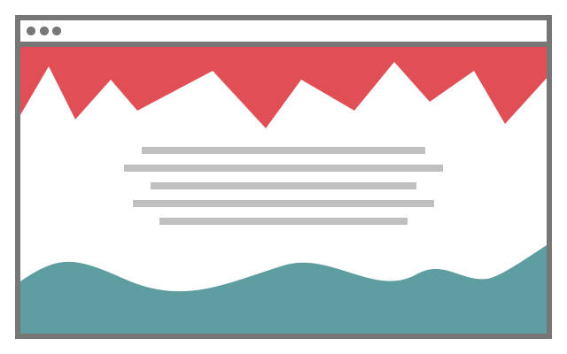

# Creative SVG for Developers

Workshop for [Booster 2017](https://www.boosterconf.no/talks/860)

Scalable Vector Graphics (SVG) can be drawn up in graphics software or hand coded in an editor. In this workshop, we are going to do both! \o/ We’ll play around with basic shapes and paths in Inkscape, before we dive into `<path>` and `<polygon>` to bring stunning designs the browser.

If your happy place is usually filled with code — and drawing sounds scary — this workshop is especially for you.

## Exercises

“But I can’t draw,” you say…? Sure you can! Because basic shapes and simple lines will do just fine. There is so much we can make without any classic drawing skills, and this is what we want to show you.

## Useful links

* [Pocket Guide to Writing SVG](http://svgpocketguide.com/book/) by Joni Trythall.
* [Intro to using SVG](https://css-tricks.com/using-svg/) by Chris Coyier.
* [Tools to Visualize and Edit SVG Paths](https://css-tricks.com/tools-visualize-edit-svg-paths-kinda/)
* [SVG Optimizer](https://github.com/svg/svgo) is a Nodejs-based tool for optimizing SVG vector graphics files.
* [SVGOMG](https://jakearchibald.github.io/svgomg/) is a GUI for SVGO.
* [In-depth articles on SVG](https://sarasoueidan.com/tags/svg/) by Sara Soueidan.
* [A Complete Guide to SVG Fallbacks](https://css-tricks.com/a-complete-guide-to-svg-fallbacks/) by Amelia Bellamy-Royds.
* [SVG element reference](https://developer.mozilla.org/en-US/docs/Web/SVG/Element) on MDN.

